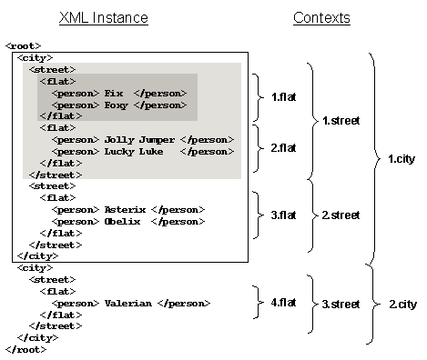

# Map multiple occurrences of a node to another node with different occurrence in message mapping

\| [Recipes by Topic](../../readme.md ) \| [Recipes by Author](../../author.md ) \| [Request Enhancement](https://github.com/SAP-samples/cloud-integration-flow/issues/new?assignees=&labels=Recipe%20Fix,enhancement&template=recipe-request.md&title=Improve%20Map-multiple-occurrences-of-a-node-to-another-node-with-different-occurrence-in-message-mapping ) \| [Report a bug](https://github.com/SAP-samples/cloud-integration-flow/issues/new?assignees=&labels=Recipe%20Fix,bug&template=bug_report.md&title=Issue%20with%20Map-multiple-occurrences-of-a-node-to-another-node-with-different-occurrence-in-message-mapping ) \| [Fix documentation](https://github.com/SAP-samples/cloud-integration-flow/issues/new?assignees=&labels=Recipe%20Fix,documentation&template=bug_report.md&title=Docu%20fix%20Map-multiple-occurrences-of-a-node-to-another-node-with-different-occurrence-in-message-mapping ) \|

 | [Meghna Shishodiya](https://github.com/author-profile ) |
----|----|

This recipe shows how to assign value of source node to target when the number of occurrences differ.

## Recipe**Scenario:**
In cases when a source field occurs a variable number of times in the incoming message, during message mapping it is important to define the context correctly to ensure that the right values are assigned to the target fields.
Assume an incoming message structure as:

Fix and Foxy are in the first flat context, Jolly Jumper and Lucky Luke are in the second, and all four are in the first street context. The first <street> field is in the first city context and so on.

Let us assume that you want to map this structure to the following list to include all those people from the first city and the first street:
`<personList minOccurs=”1” maxOccurs=”1”>
  <person minOccurs=“0” maxOccurs=”unbounded“>`

>The root node (in this case <personList>) always appears exactly once. This is displayed explicitly in the target structure.

You want to list all four people from the first street context (Fix, Foxy, Lucky Luke, and Jolly Jumper).

Define a target field mapping for <person>:
`\personList\person=\root\city\street\flat\person`

This XML instance produces the following result:
`<personList>
   <person> Fix </person>
   <person> Foxy </person>
</personList>`

It only generates Fix and Foxy from the first flat context. To understand why this is the case, we can look at the processing:

 1.  The root node `<personList>` is generated because it is obligatory.
 2.      The message mapping checks in the `<personList>` context whether there is a target field mapping for `\personList\personand` whether there are values for this in the XML instance. The mapped `\root\city\street\flat\person` field is in the first flat context.
 3.      The message mapping generates fields in the target structure for Fix and Foxy in the first flat context. Once the first flat context has been processed it is closed along with the `<personList>` context in the target structure.

The transformation is completed with the last step because all target structure fields have been processed. The example shows the following:
* The `<flat>` structure node is implicitly assigned to the `<personList>` root node during mapping. `<personList>` is generated as often as is predefined in the schema, therefore once (see also: [Mapping Fields Within a Context](https://help.sap.com/saphelp_banking60/helpdata/en/e4/82cf0ec8b9494db92e27e2be69524f/content.htm)).
* The list only includes Fix and Foxy because they are in a different context to Jolly Jumper and Lucky Luke.

You can set the context individually for each field in the source structure in the [Data-Flow Editor](https://help.sap.com/saphelp_banking60/helpdata/en/50/19b7814d480d47a6f95ce8f864905c/content.htm) context menu.

If you set the <street> context for \root\city\street\flat\person, then prior to the mapping, all <person> fields are appended to the next highest field, which is <street>. Depending on how you set the context in the source structure, you will get the following results:

 > The [removeContexts()](https://help.sap.com/saphelp_banking60/helpdata/en/1f/ea0fb12403844bbb6c4cbc8a00cda9/content.htm) standard function assigns the fields assigned to it to the root node. You will get the same effect if you assign the root context to this type of field.

>The higher-level context of an attribute is the element to which it is assigned. The above statements relating to fields also apply to attributes.

Technically speaking, the XML instance is imported into the queues before the target field mappings are processed. The contexts are separated in the queue by a context change. You can address these queues directly in [advanced user-defined functions](https://help.sap.com/saphelp_banking60/helpdata/en/f8/2857cbc374da48993c8eb7d3c8c87a/content.htm).
